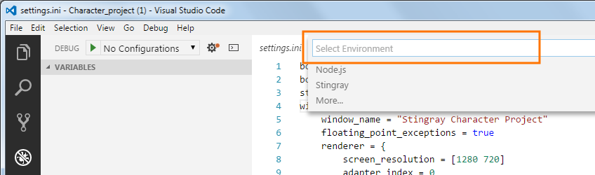
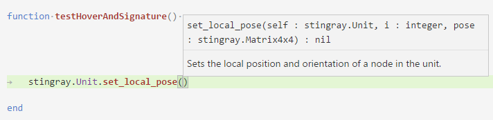
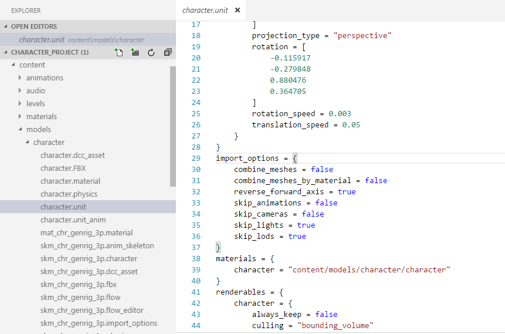

# Stingray Debugger

Use the [Visual Studio Code](https://code.visualstudio.com) editor and debugger with your [Autodesk® Stingray](http://www.stingrayengine.com) projects!

Find the extension [here, in the Visual Studio Code marketplace](https://marketplace.visualstudio.com/items?itemName=jschmidt42.stingray-debug).

## 1.4 (New features and bug fixes)

* Auto-completion for the Stingray Lua API, based on the [Stingray Lua reference](http://help.autodesk.com/view/Stingray/ENU/?guid=__lua_ref_index_html).
* Add a `compile:boolean` launch option, so you can compile your project before launching without having to use the command-line flag.
* You now have to prefix console commands that you send to the engine with `--` instead of `#`.
* The callstack now gets evaluated even if the source file cannot be found.
* The extension can find files and code in your core folder if you provide your `toolchain` path.
* You can now send engine commands through the **Command Palette**. Type `Stingray Command`, hit `Enter`, then type the command you want to send.

## Description

This extension makes Visual Studio Code into a full-featured code editing debugging environment for your Stingray projects. You can connect the debugger to a running engine, launch a project, trigger breakpoints and step through your project's Lua code, view variable values, send commands to the engine, and more.

If you haven't heard about Stingray yet, check out the following links:

- [The main Stingray site at www.autodesk.com](https://www.autodesk.com/products/stingray/overview), where you can download a trial version.
- [The Stingray Learning Center](http://help.autodesk.com/view/Stingray/ENU/), where you can find help, tutorials, and reference docs.
- [The Stingray SDK Help](http://help.autodesk.com/view/Stingray/ENU/?guid=__sdk_help_introduction_html), useful if you want to write your own plug-in to extend Stingray.

## Step 1. Install the extension

Bring up the Extensions view by clicking the Extensions icon in the Activity Bar on the left side of Visual Studio Code, or selecting **View > Extensions** (`Ctrl+Shift+X`) from the main menu.

Search for `Stingray Debugger`. You should find something like this:


For more about installing extensions, see the [Visual Studio Code user guide](https://code.visualstudio.com/docs/editor/extension-gallery).

## Step 2. Open your project folder

Open your Stingray project folder in Visual Studio Code. This will be your workspace, where Visual Studio Code will keep your debug configurations.

Select **File > Open Folder** (`Ctrl+K Ctrl+O`) from the main menu, and browse to the folder that contains your project's *.stingray_project* file.

You can make any folder on your computer your workspace, but using your project's resources folder has the advantage of keeping your debug configurations together with the project that you'll be using them with. It also makes the Lua files in your project easy to get to in the editor while you're working.

## Step 3. Create your debug configurations

A *debug configuration* tells the Visual Studio Code debugger what it should do when you start debugging: whether it connect to a running process or launch a new process, and what settings and parameters it should use for the connection.

You can read some background about these configs [here](https://code.visualstudio.com/docs/editor/debugging).

You'll have to create at least one new debug configuration in order to make the debugger able to attach to or launch the Stingray engine.

1.	Bring up the Debug view by clicking the Debug icon in the Activity Bar on the left side of Visual Studio Code, or by selecting **View > Debug** (`Ctrl+Shift+D`) from the main menu.

2.	Click the  or  icon in the Debug view. You'll be prompted to select the type of environment you want to debug:

	

3.	Choose `Stingray`. You'll get a new file called `launch.json`, pre-set with a default configuration. See the following sections for details on how to set up the parameters.

	Each configuration that you set up in this file will be accessible by name in the drop-down list at the top of the Debug view, so that you can quickly select the configuration you want to use each time you start debugging.

### Attach to a running engine

You can make the Visual Studio Code debugger connect to a running instance of the Stingray engine. Use the following launch configuration:

```javascript
{
	// Standard Visual Studio debugger parameters.
	"type": "stingray",
	"request": "attach", // Use attach here to make the debugger connect to an existing process.
	"name": "My Stingray Game",

	// The IP address of the device running the Stingray engine.
	"ip": "127.0.0.1",

	// The port the engine is using for console communications.
	"port": 14000
}
```

The `port` setting to use depends on how you've launched the engine:

-	If you launched the engine using the editor's Test Level feature, use `14000`.

-	If you launched the engine on Windows using the editor's Run Project feature, or by running a deployed project (with the `dev` configuration), the engine chooses a free port between `14000` and `14030` inclusive. This means that you might not have the same port number every time you run. To specify a pre-set port number when you launch the engine, you can use the `--port <number>` command-line parameter.

	**Tip:** to specify a port when you use the editor's Run Project feature, add the `--port <number>` command-line parameter to the default `localhost` connection listed in the **Connections** panel of the Stingray editor.

-	You can also connect to the instance engine that the editor runs internally. This can be useful in order to debug the Lua code in the `core/editor_slave` folder, which provides viewport behaviors for the editor. In this case, use port `14030`.

-	For engines running on most non-Windows platforms, use `14030`. For Xbox 360, use `4601`.

### Launch a project and attach

You can make the Visual Studio Code debugger launch the Stingray engine with a specific project, and immediately attach itself to that instance of the engine. The engine will wait for the debugger to connect and start the debugging session before it runs any Lua initialization code.

Launching the game from the debugger like this makes it easy to trigger breakpoints in your initialization code:


To set this up, use a launch configuration like this:

```javascript
{
	// Standard Visual Studio debugger parameters.
	"type": "stingray",
	"request": "launch",  // Use launch here to start a new process.
	"name": "Pitchcrawl",

	// Folder where Stingray is installed.
	"toolchain": "C:\\Program Files\\Autodesk\\Stingray\\1.8.1218.0",

	// Full path to the project you want to launch for debugging.
	"project_file": "D:/pitchcrawl/pitchcrawl.stingray_project",

	// Recompile any modified resources in the project before launching.
	"compile":true

	// Optional command line arguments you would like to pass to the engine.
	"command_line_args": [
		// Run the game using DirectX 11.
		"--dx11",
		// Specifies the dimensions of the engine main window.
		"--rect", 100, 100, 1280, 720
	]
}
```

You don't have to provide any command-line parameters. The debugger extension will set the ones it needs, like `--port` and `--data-dir`. But you can add your own if you want to customize something about the way the engine starts up. For the complete list of command-line arguments the engine accepts, see [the Stingray Help](http://help.autodesk.com/view/Stingray/ENU/?guid=__stingray_help_reference_engine_command_line_html).

## Step 5. Start debugging!

1.	In the Debug view, choose the debug configuration you want to use from the drop-down list.

2.	Press the green play button  to connect:

	

If the debugger is able to connect to the game, it will show the [Debug actions pane](https://code.visualstudio.com/docs/editor/debugging#_debug-actions). You should now be able to open your project or editor script files and set up some breakpoints.

## Debugging features

### Set breakpoints, inspect and advance

You can set breakpoints in any Lua scripts from your project and from the core resources. Open the script file and click in the left margin next to a line of code:


Whenever the engine evaluates a line of code that has a breakpoint set, it pauses. While it's paused, you can:

-	Inspect the values of your local Lua varibles in the **Variables** list, or by hovering over the variables in the code editing window.

-	Use the **Call stack** to navigate back up through the trail of functions that are currently in progress.

-	Use the [Debug actions pane](https://code.visualstudio.com/docs/editor/debugging#_debug-actions) to control the engine. For example, you can resume code execution until the next breakpoint is hit, or you can step forward through the evaluation of your code line-by-line.

	Whenever you step in to a function located in a new file, Visual Studio Code will automatically open the file for you.

-	The restart button in the [Debug actions pane](https://code.visualstudio.com/docs/editor/debugging#_debug-actions) reboots the engine. This reloads and refreshes all resources, and restarts the game. If you place a breakpoint in the project's initialization code, the debugger should break into it when you restart.


### Read console messages

Just like the **Log Console** in the Stingray editor, the **Debug Console** in Visual Studio Code prints out all console messages sent by the connected engine:


If any of those messages contain ID strings known to the engine (e.g. `#ID[xxxxxxxx]`), the extension will try to resolve them to their original string values.

### Send engine commands

You can send console commands to the engine from the **Debug Console**. Prefix the commands with `--`:


You can also send commands from the **Command Palette**. Open the Command Palette, type `Stingray Command` and hit `Enter`. Then, enter the command you want to send (without the `--` prefix).

For a list of all available console commands and their parameters, see [the Stingray help](http://help.autodesk.com/view/Stingray/ENU/?guid=__stingray_help_reference_console_commands_html).

### Send engine scripts

Everything that you type in the **Debug Console** that is *not* prefixed with `--` will be sent to the engine as a Lua script. The engine will evaluate this script in its Lua environment and print the return value.


## Code editing features

This extension does more than just debugging: it also adds some extra features to the code editor that you'll find especially handy when you work with Stingray projects.

### Stingray Lua API hovering support

Hover over any function from the Stingray API to get the function's signature and brief description:


### Stingray Lua API function signatures

You'll also be reminded of the signature and description as you type the opening bracket for a function:



### Syntax highlighting for SJSON resources

The code editor shows appropriate syntax highlighting for Stingray resource types that use [SJSON format](http://help.autodesk.com/view/Stingray/ENU/?guid=__stingray_help_managing_content_sjson_html), like *.unit*, *.level*, and *.script_flow_nodes*.



## Feedback and contributions welcome!

If you tried out this extension, why not leave us a note on its [marketplace home page](https://marketplace.visualstudio.com/items?itemName=jschmidt42.stingray-debug)?
 We'd love to hear feedback about your experience, and any suggestions you have for things we could improve or add.

If you'd like to get involved in adding more features, come on over to our [GitHub repository](https://github.com/jschmidt42/stingray-vscode-debugger). You can use the Issues tab to start a discussion, or jump right in and make your own fork.
